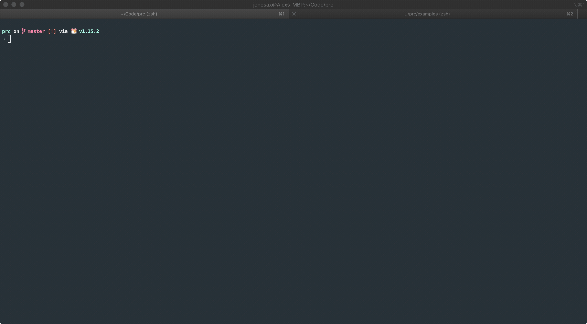

# prc

[](https://codeclimate.com/github/AlexsJones/prc/maintainability)

**Prometheus Rule Converter**

This program will convert recording rules into `PrometheusRule` type custom resource definitions


`go get github.com/AlexsJones/prc`




Example usage would be:

Converting an explicit recording rule
```
prc convert --from-file=examples/kube-recording-rules.yaml -r k8sPromRules
```

Converting a directory of recording rules
```
prc convert --from-files examples/rules  -o examples/crd
```
